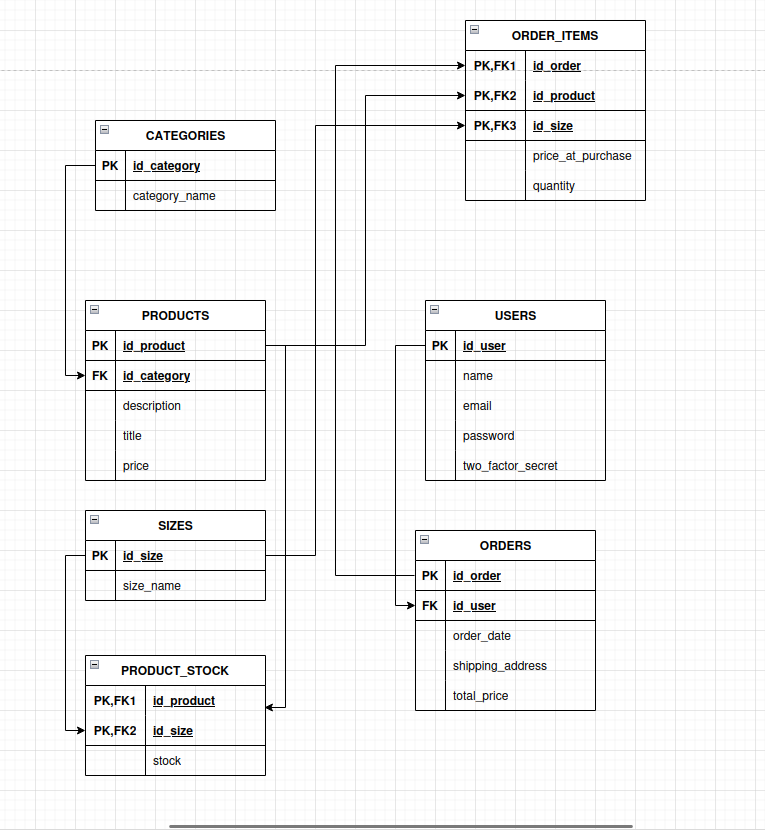

# Deployment Guide: Remote PostgreSQL Infrastructure

This guide documents the complete process for creating, installing, and configuring a distributed database environment using **VirtualBox** on a **Linux Mint** host.

---

## 1. Network Configuration (Infrastructure Layer)

To make the virtual machines behave like real devices within your local network and communicate with each other, we will use the **Bridged Adapter** mode.

1. **Power off the VMs**: Ensure both machines are shut down before modifying network settings.
2. In the VirtualBox menu, select your VM and go to **Settings > Network**.
3. **Adapter 1**:
   * **Attached to**: Bridged Adapter.
   * **Name**: Select your active physical network interface (e.g., `wlp3s0` for Wi-Fi or `enp2s0` for Ethernet).
   * **Advanced**: Promiscuous Mode -> **Allow All**.
4. **Repeat** these steps for the second VM.

---

## 2. Database Server (VM-bbdd)

### A. Core Installation
Run the following commands to update the system and install PostgreSQL:
```bash
sudo apt update && sudo apt upgrade -y
sudo apt install postgresql postgresql-contrib -y
```

### B. Opening Ports (Firewall)
Allow incoming traffic through the default PostgreSQL port:
```bash
sudo ufw allow 5432/tcp
sudo ufw reload
sudo ufw status
```

### C. External Listen Configuration
By default, PostgreSQL only accepts local connections. Edit the main configuration file to allow network listening:
```bash
sudo nano /etc/postgresql/14/main/postgresql.conf
```
Find the line `#listen_addresses = 'localhost'` and modify it as follows:
```text
listen_addresses = '*'
```

### D. Access Authorization (pg_hba.conf)
Define which machines and users are allowed to connect remotely using a secure encryption method.
```bash
sudo nano /etc/postgresql/14/main/pg_hba.conf
```
Scroll to the very bottom of the file and append the following line:
```text
# TYPE  DATABASE        USER            ADDRESS                 METHOD
host    web_scraping    webuser         10.109.99.2/16          scram-sha-256
```

### E. Database Objects Creation
Access the native PostgreSQL administrative console:
```bash
sudo -u postgres psql
```
Inside the PostgreSQL prompt, execute the following SQL statements:
```sql
CREATE DATABASE web_scraping;
CREATE USER webuser WITH PASSWORD 'your_secure_password';
GRANT ALL PRIVILEGES ON DATABASE web_scraping TO webuser;
\q
```

### F. Applying Changes
Restart the service to load the new network and access configurations:
```bash
sudo systemctl restart postgresql
```

---

## 3. Client Machine (VM-web)

### A. Client Utilities Installation
You do not need the full database server on the client machine, only the communication utilities:
```bash
sudo apt update
sudo apt install postgresql-client -y
```

### B. Server IP Identification
Go to the **Server VM (VM-bbdd)** terminal and find the IP address assigned by your router:
```bash
ip a
```
*(Identify the IP address next to your active network interface, for example: `192.168.1.50`).*

### C. Remote Connection
Return to the **Client VM (VM-web)** terminal and run the connection command using the server IP:
```bash
psql -h <SERVER_IP> -U webuser -d web_scraping
```

---

## 4. Quick Reference and Troubleshooting

### Useful Commands


| Command | Function |
| :--- | :--- |
| `systemctl status postgresql` | Check if the database server is up and active. |
| `ip a` | View the current IP address assigned to the virtual machine. |
| `sudo nano /etc/postgresql/14/main/pg_hba.conf` | Manage incoming access permissions to the databases. |
| `psql -l` | List all existing databases (run from the server). |

### Common Error Resolution
* **Connection timeout:** Verify that the server's firewall (`ufw`) has the `5432/tcp` port open.
* **Ident authentication failed:** Check that the method specified in `pg_hba.conf` is `scram-sha-256` or `md5`, and double-check your password.
* **No route to host:** Confirm that both VMs are set to **Bridged Adapter** mode and belong to the same local network subnet (e.g., both IPs start with `192.168.1.X`).


